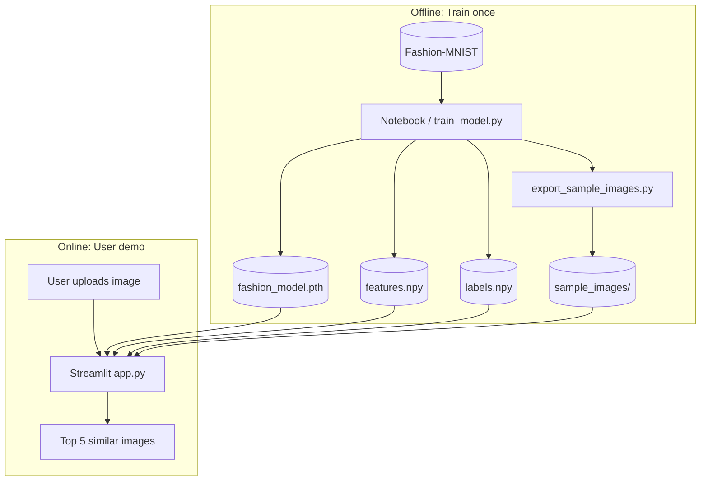
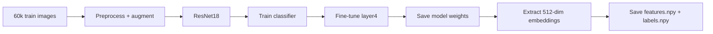
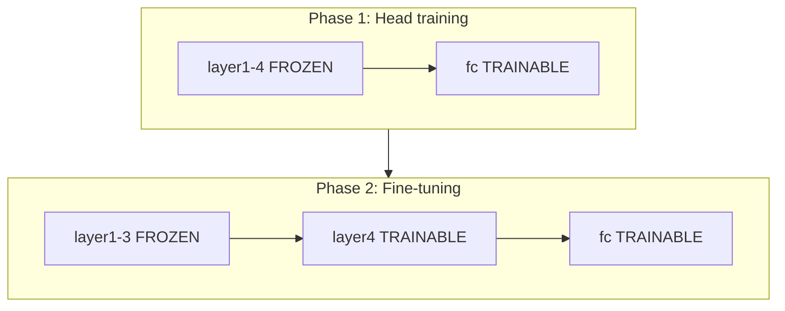
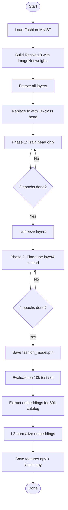
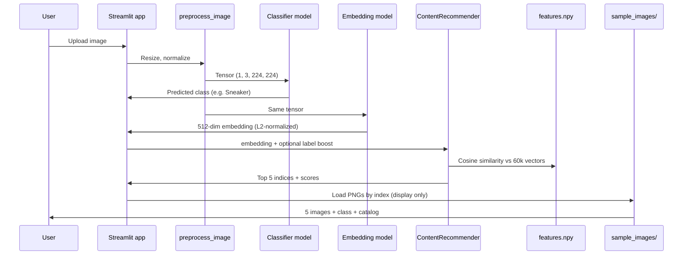
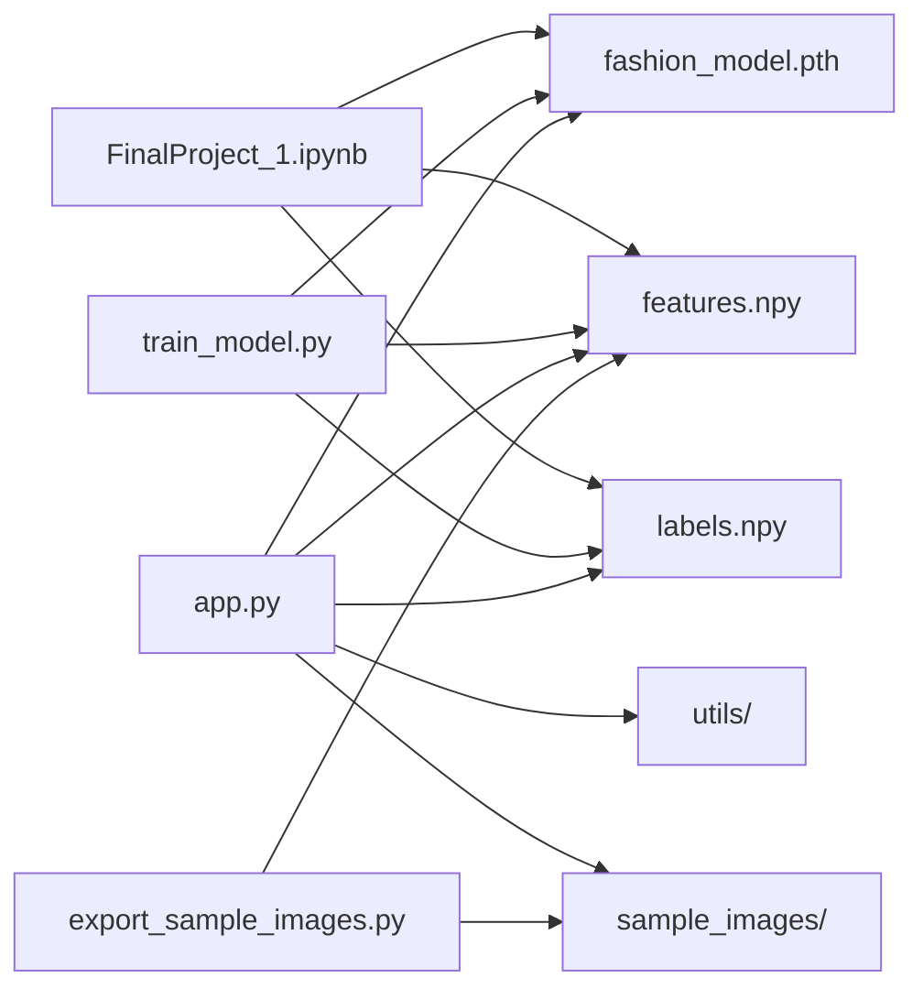

# Fashion Image Recommendation Engine — Learning Guide

A complete guide to understanding this project from scratch: what it does, how it works, how training is set up, and how all the pieces connect.

---

## Table of contents

1. [What is this project?](#1-what-is-this-project)
2. [Key concepts in plain English](#2-key-concepts-in-plain-english)
3. [The dataset: Fashion-MNIST](#3-the-dataset-fashion-mnist)
4. [Project architecture (big picture)](#4-project-architecture-big-picture)
5. [ResNet18 explained](#5-resnet18-explained)
6. [Transfer learning](#6-transfer-learning)
7. [Image preprocessing](#7-image-preprocessing)
8. [Training framework (step by step)](#8-training-framework-step-by-step)
9. [What gets saved after training](#9-what-gets-saved-after-training)
10. [features.npy vs labels.npy](#10-featuresnpy-vs-labelsnpy)
11. [Embeddings and L2 normalization](#11-embeddings-and-l2-normalization)
12. [How recommendations work](#12-how-recommendations-work)
13. [Train vs test split and data folders](#13-train-vs-test-split-and-data-folders)
14. [The Streamlit app](#14-the-streamlit-app)
15. [File and folder map](#15-file-and-folder-map)
16. [Notebook vs training script](#16-notebook-vs-training-script)
17. [Important settings explained](#17-important-settings-explained)
18. [How to run everything](#18-how-to-run-everything)
19. [Glossary](#19-glossary)

---

## 1. What is this project?

This project is a **content-based image recommendation system** for fashion.

**Content-based** means recommendations come from the **image itself** — not from what other users bought or clicked. The system looks at visual similarity.

**Simple flow:**

```
You give it an image  →  It finds the 5 most similar images in a catalog
```

**Example:** Upload a sneaker photo → get back 5 other sneaker-like images from the catalog.

**Two main parts:**

| Part | File(s) | Purpose |
|------|---------|---------|
| **Training pipeline** | `FinalProject_1.ipynb`, `scripts/train_model.py` | Train the AI model, build the catalog |
| **Demo app** | `app.py` + `utils/` | Let users upload images and see recommendations |

---

## 2. Key concepts in plain English

### Content-based recommendation
Recommends items that **look like** the query image. No user history needed.

### Classification vs recommendation
- **Classification:** "This is a T-shirt" (one label out of 10)
- **Recommendation:** "Here are 5 images most similar to this one" (search in a catalog)

We train for classification first, then use the model's internal representation for recommendation.

### Embedding (feature vector)
A list of numbers (512 in our case) that summarizes an image. Similar images → similar lists of numbers. Think of it as a **fingerprint** for the image.

### Cosine similarity
A way to measure how similar two fingerprints are. Higher score = more similar. Used to rank catalog items.

### Transfer learning
Starting from a model already trained on millions of photos (ImageNet), then adapting it to fashion. Faster and better than training from zero.

### Epoch
One full pass through the entire training dataset. If you have 60,000 images, 1 epoch = the model has seen all 60,000 once.

### Freezing / fine-tuning
- **Frozen layer:** weights stay fixed (not updated during training)
- **Fine-tuning:** allow some layers to update and adapt to our fashion data

---

## 3. The dataset: Fashion-MNIST

**Fashion-MNIST** is a standard benchmark dataset of clothing images.

| Property | Value |
|----------|-------|
| Training images | 60,000 |
| Test images | 10,000 |
| Original size | 28×28 pixels, grayscale |
| Number of classes | 10 |

### The 10 classes

| ID | Class name |
|----|------------|
| 0 | T-shirt |
| 1 | Trouser |
| 2 | Pullover |
| 3 | Dress |
| 4 | Coat |
| 5 | Sandal |
| 6 | Shirt |
| 7 | Sneaker |
| 8 | Bag |
| 9 | Ankle boot |

### What we do to images before the model sees them

Fashion-MNIST images are tiny (28×28). ResNet18 expects larger input, so we:

1. **Resize** to 224×224
2. **Convert grayscale → 3 channels** (ResNet expects RGB-style input)
3. **Normalize** using ImageNet mean and standard deviation
4. **Augment** during training only (random flip, small rotation)

```
Raw Fashion-MNIST (28×28 gray)
        ↓
   Resize to 224×224
        ↓
   3-channel tensor
        ↓
   Normalize (ImageNet stats)
        ↓
   Ready for ResNet18
```

---

## 4. Project architecture (big picture)

### System overview



### Data flow during training



### Data flow during recommendation


---

## 5. ResNet18 explained

### Does "18" mean 18 layers?

**Not exactly.** The name comes from the ResNet paper: **18 weighted layers** (layers with learnable parameters like convolutions and fully connected layers).

ResNet18 is not "18 steps in a row." It is organized into **blocks**:

```
Input (224×224×3)
    │
    ▼
┌─────────────┐
│ conv1       │  Initial convolution + pooling
└─────────────┘
    │
    ▼
┌─────────────┐
│ layer1      │  2 residual blocks — basic edges/textures
└─────────────┘
    │
    ▼
┌─────────────┐
│ layer2      │  2 residual blocks — simple shapes
└─────────────┘
    │
    ▼
┌─────────────┐
│ layer3      │  2 residual blocks — mid-level patterns
└─────────────┘
    │
    ▼
┌─────────────┐
│ layer4      │  2 residual blocks — high-level features
└─────────────┘
    │
    ▼
┌─────────────┐
│ avgpool     │
└─────────────┘
    │
    ▼
┌─────────────┐
│ fc (head)   │  Final classifier → 10 fashion classes
└─────────────┘
```

### What each part does (intuition)

| Part | Level | Learns (roughly) |
|------|-------|------------------|
| layer1–2 | Low | Edges, corners, textures |
| layer3 | Mid | Parts of objects, combinations of shapes |
| layer4 | High | Object-level features (good for "type of clothing") |
| fc (head) | Decision | Which of the 10 classes |

### What we use in this project

| Component | Role in training | Role in recommendation |
|-----------|------------------|------------------------|
| layer1–layer3 | Frozen (not updated) | Used to compute embeddings |
| layer4 | Fine-tuned in phase 2 | Used to compute embeddings |
| fc (head) | Trained for classification | Used in app to detect category |

For recommendations, we mostly use everything **before** the final `fc` layer. That output is the **512-dimensional embedding**.

### Residual blocks (why "Res"Net)

ResNet uses **skip connections**: input can bypass a block and be added to its output. This helps deep networks train without losing information.

You do not need to implement this — torchvision provides ResNet18 ready to use. It is useful to know that "ResNet" = Residual Network.

---

## 6. Transfer learning

### The idea

ResNet18 was already trained on **ImageNet** (~1 million general photos: animals, cars, objects, etc.). That pretrained model already knows how to detect useful visual patterns.

We **reuse** that knowledge and teach it fashion:

```
Pretrained on ImageNet  →  Adapt to Fashion-MNIST  →  Use for recommendations
```

### Why not train from scratch?

| From scratch | Transfer learning |
|--------------|-------------------|
| Needs huge data and time | Works well with 60k images |
| Random initialization | Starts with useful features |
| Harder on CPU | Practical for this project |

### How we apply it

1. Load ResNet18 with ImageNet weights
2. **Freeze** most layers (keep pretrained weights)
3. Replace the last layer (`fc`) for 10 fashion classes
4. Train the new head
5. **Unfreeze layer4** and fine-tune gently



---

## 7. Image preprocessing

Preprocessing must be **identical** during training, feature extraction, and the Streamlit app. A mismatch here was a major cause of bad recommendations in the old setup.

### Steps (in order)

| Step | What it does | Why |
|------|--------------|-----|
| Resize (224×224) | Makes all images same size | ResNet18 expects 224×224 |
| Grayscale → 3 channels | Duplicates gray into R,G,B | Model expects 3 channels |
| ToTensor | Converts to numbers 0–1 | PyTorch format |
| Normalize | Subtract mean, divide by std | Matches ImageNet pretrained weights |

### ImageNet normalization values

```
mean = (0.485, 0.456, 0.406)
std  = (0.229, 0.224, 0.225)
```

These are defined in:
- `FinalProject_1.ipynb` (config cell)
- `utils/preprocessing.py` (Streamlit app)

### Train vs eval transforms

| Transform | Used when | Includes augmentation? |
|-----------|-----------|------------------------|
| `train_transform` | Training only | Yes (flip, rotation) |
| `eval_transform` | Test, feature extraction, app | No |

Augmentation is only for training — it artificially creates variations so the model generalizes better. We never augment when testing or recommending.

---

## 8. Training framework (step by step)

Training can be run from:
- **`FinalProject_1.ipynb`** (interactive, good for learning)
- **`scripts/train_model.py`** (terminal, good for long CPU runs)

Both follow the **same logic** and produce the **same output files**.

### Training pipeline diagram



### Phase 1 — Head training (8 epochs)

| Setting | Value |
|---------|-------|
| What trains | `fc` layer only |
| What is frozen | layer1, layer2, layer3, layer4 |
| Learning rate | 0.001 |
| Data | 60,000 training images |
| Augmentation | Yes |

**Goal:** Teach the final layer to map ResNet features → fashion class labels.

### Phase 2 — Fine-tuning (4 epochs)

| Setting | Value |
|---------|-------|
| What trains | `fc` + `layer4` |
| What is frozen | layer1, layer2, layer3 |
| Learning rates | fc: 0.001, layer4: 0.0001 |
| Data | Same 60,000 images |
| Augmentation | Yes |

**Goal:** Adjust high-level visual features for fashion images without destroying low-level pretrained knowledge.

**Why lower LR for layer4?** Pretrained weights are already good. We nudge them carefully.

### What happens inside one epoch

```
For each batch of 64 images:
    1. Forward pass  → model predicts classes
    2. Compute loss  → how wrong were the predictions?
    3. Backward pass → compute gradients
    4. Optimizer step → update trainable weights
```

After all batches in the epoch, the model has seen every training image once.

### Loss function and optimizer

| Component | Choice | Purpose |
|-----------|--------|---------|
| Loss | CrossEntropyLoss | Standard for multi-class classification |
| Optimizer | Adam | Adaptive learning rate, works well in practice |
| Batch size | 64 | Balance between speed and memory |

### Evaluation

After training, we run the model on the **10,000 test images** (never seen during training) and report:

```
Test Accuracy = correct predictions / 10,000 × 100%
```

Target with the improved setup: **~92.81%** test accuracy (measured on the 10k held-out test set).

---

## 9. What gets saved after training

After a full training run you should have three main artifacts plus the image catalog.

| File | Shape / size | Created when |
|------|----------------|--------------|
| `models/fashion_model.pth` | ~43 MB | End of training |
| `features/features.npy` | (60000, 512) | Feature extraction |
| `features/labels.npy` | (60000,) | Feature extraction |
| `data/sample_images/*.png` | 60,000 files | `export_sample_images.py` |

Verify everything with:

```bash
python scripts/verify_training.py
```

Expected output: `ALL CHECKS PASSED (10/10)`.

### `models/fashion_model.pth`

The trained neural network weights (all of ResNet18 including the fashion head).

Used by:
- Notebook (load and evaluate)
- App (classify uploads + extract embeddings)

---

## 10. features.npy vs labels.npy

These two files are created **at the same time** during feature extraction. They share the same row index.

### `features/features.npy` — how images **look**

| Property | Value |
|----------|-------|
| Shape | `(60000, 512)` |
| Dtype | `float32` |
| One row | 512-number visual fingerprint (embedding) |
| L2-normalized | Yes (each row has length ≈ 1) |
| Source | Model backbone output for each **training** image |

**Used for:** finding similar images (cosine similarity search). This is the main engine of recommendations.

### `features/labels.npy` — what each catalog image **is**

| Property | Value |
|----------|-------|
| Shape | `(60000,)` |
| Dtype | `int64` |
| One value | Class ID 0–9 (T-shirt, Sneaker, etc.) |
| Source | Fashion-MNIST ground truth (dataset already knows the answer) |

**Used for:**
- Showing class names under recommendations in the app
- Optional same-category boost (sidebar checkbox)
- Notebook metrics (e.g. recommendation hit rate)

**Not used for:** picking which images are similar. Search uses `features.npy` only.

### How `labels.npy` is created

During feature extraction we loop over all 60k training images. PyTorch gives us **both** the image and its label:

```python
for images, labels in feature_loader:
    output = feature_extractor(images)   # → save rows to features.npy
    labels_all.append(labels.numpy())    # → save to labels.npy (copy from dataset)
```

We do **not** predict labels for the catalog. We copy the **true labels** from Fashion-MNIST.

### Index alignment (critical)

```
Index 4271:
  features.npy[4271]  = [0.02, 0.06, ...]     ← visual fingerprint
  labels.npy[4271]    = 7                       ← Sneaker
  sample_images/4271.png                        ← the picture
```

All three must refer to the **same** training image.

### Side-by-side summary

| | `features.npy` | `labels.npy` |
|---|----------------|--------------|
| Stores | 512 floats (look) | 1 integer (category) |
| Search? | **Yes** | No |
| Display / boost? | No | **Yes** |
| Analogy | Face fingerprint | Name tag on the person |

---

## 11. Embeddings and L2 normalization

### What is an embedding?

When an image passes through the ResNet18 **backbone** (everything except the final `fc`), the output is a vector of **512 numbers**:

```
Image  →  Backbone  →  [0.12, -0.34, 0.08, ..., 0.19]   (512 values)
```

Similar-looking images tend to produce similar vectors. We call this vector an **embedding** or **feature vector**.

---

### What is L2 normalization?

**L2 normalization** scales a vector so its **length becomes 1**, while keeping the **same direction**.

#### Step-by-step (2D example — easy to picture)

Take a vector `[3, 4]`:

1. **Length (L2 norm):** `√(3² + 4²) = √(9 + 16) = √25 = 5`
2. **Divide each component by 5:** `[3/5, 4/5] = [0.6, 0.8]`
3. **Check new length:** `√(0.6² + 0.8²) = √(0.36 + 0.64) = 1` ✓

Formula (works for 512 dimensions too):

```
normalized_vector = vector / ||vector||

where  ||vector|| = √(v₁² + v₂² + ... + v₅₁₂²)
```

In code (what our project does):

```python
norms = np.linalg.norm(features, axis=1, keepdims=True)
features = features / np.maximum(norms, 1e-8)
```

#### Another intuition: same direction, different “volume”

| Vector | Length | After L2 normalize |
|--------|--------|---------------------|
| `[3, 4]` | 5 | `[0.6, 0.8]` |
| `[30, 40]` | 50 | `[0.6, 0.8]` ← **same direction!** |
| `[6, 8]` | 10 | `[0.6, 0.8]` |

L2 normalization removes “how loud” the vector is and keeps “which way it points.”

**Analogy:** Two people describing the same song — one whispers, one shouts. L2 normalize = turn both to the same volume so you compare **what** they said, not **how loud**.

---

### Raw embedding vs L2-normalized

| | Raw embedding | L2-normalized |
|---|---------------|---------------|
| From model | Direct output | Raw ÷ length |
| Length | Can vary a lot | Always 1 |
| What cosine similarity focuses on | Direction + some magnitude effects | **Direction only** |
| In our project | Not saved to disk | **Saved in `features.npy`** |

---

### Why we use L2 normalization in this project

Recommendations use **cosine similarity**. Cosine similarity measures the **angle** between two vectors (how aligned their directions are).

For **unit vectors** (length = 1), cosine similarity is especially clean:
- **1.0** → same direction → very similar
- **0.0** → perpendicular → unrelated
- Closer to 1 → better match

If we did **not** normalize:
- One image might produce a “long” embedding and another a “short” one
- Comparisons could be unfair (magnitude noise)
- Rankings would be less stable

**Rule in our pipeline:**

```
Catalog (features.npy)     → L2-normalized when saved
Upload (app / notebook)    → L2-normalized before search
```

Both sides must use the same rule — otherwise similarity scores are misleading.

---

### Visual intuition (2D)

Think of each embedding as an arrow from the origin:

```
        ↑
        |      • B (similar style to A)
        |     /
        |    /   small angle → high cosine similarity
        |   /
        |  • A (query)
        |
        +----------------→

        • C (very different direction) → low similarity
```

L2 normalization places every arrow on the **unit circle** (length 1). We only compare **which way** they point.

---

### Where L2 happens in the code

| Step | File | What happens |
|------|------|----------------|
| Save catalog | `train_model.py` / notebook feature cell | Normalize all 60k rows → `features.npy` |
| Upload search | `app.py` → `get_embedding()` | Normalize query before `recommend()` |
| Search | `utils/recommender.py` | Normalize query; compare to stored features |

---

### Quick self-check questions

1. **Does L2 change what type of image it is?** No — only rescales the numbers.
2. **Do we L2-normalize labels?** No — labels are integers 0–9, not vectors.
3. **If two raw vectors point the same way, same recommendation?** Yes — that is the point.

---

## 12. How recommendations work

### Step-by-step

1. **Pick a query** — an image index (notebook) or user upload (app)
2. **Get its 512-dim embedding** — run through the trained backbone
3. **L2-normalize** the query embedding
4. **Compare to all 60,000 catalog embeddings** using cosine similarity
5. **Optionally apply same-class boost** (app sidebar; off by default)
6. **Return top 5** highest-scoring indices
7. **Load PNGs from `sample_images/`** only to display results

### Recommendations are NOT based on filenames

The app **never** searches by name. Filenames like `4271.png` are chosen **after** similarity search:

```
Upload pixels → embedding → compare 60k vectors → indices [882, 4271, ...]
                                                      ↓
                                            load 882.png, 4271.png to show
```

Renaming `4271.png` would break display only — the math would be unchanged.

### Cosine similarity (simple explanation)

Measures how aligned two embedding directions are. The app shows this as **visual match** (e.g. `0.847`).

- **Closer to 1.0** → more visually similar
- **Closer to 0.0** → less similar

Implemented via `sklearn.metrics.pairwise.cosine_similarity`.

### Same-class boost (optional)

In the **app**, sidebar checkbox **“Boost same category”** (default: **off**).

When on:

```
ranking_score = cosine_similarity + 0.15   (if catalog item has same class as detected upload)
```

When off: **pure visual similarity** from `features.npy` only.

In the **notebook**, `recommend()` can use `same_class_boost=0.15` by default — you can set it to `0` for pure visual matching.

### Excluding self-match (notebook only)

When recommending from a catalog index, we set that index's similarity to negative infinity so the query image does not recommend itself.

### Hit rate metric (notebook)

`recommendation_hit_rate()` samples random queries and checks:

```
Of the top 5 recommendations, what % share the query's class?
```

Uses `labels.npy` only for this check — not for the similarity search itself.

---

## 13. Train vs test split and data folders

### Train vs test (two different jobs)

Fashion-MNIST is pre-split:

| Split | Count | Used for |
|-------|-------|----------|
| **Train** | 60,000 | Training model + building catalog (`features.npy`) |
| **Test** | 10,000 | Accuracy only — **not** in recommendation catalog |

```
60k TRAIN  →  train model  →  features.npy (catalog)  →  sample_images/
10k TEST   →  accuracy check (92.81%)  →  NOT in features.npy
```

**Analogy:** Train = textbook + library inventory. Test = final exam (never added to the library shelves).

### `data/sample_images/` — catalog display (60,000 files)

| | |
|---|---|
| **Files** | `0.png` … `59999.png` |
| **Source** | 60k **training** images |
| **Used in search?** | **No** — search uses `features.npy` |
| **Used after search?** | **Yes** — show the top 5 results |
| **Created by** | `python scripts/export_sample_images.py` |

### `data/test_upload/` — manual test uploads (10 files)

| | |
|---|---|
| **Files** | `test_sneaker.png`, `test_dress.png`, … (one per class) |
| **Source** | 10k **test** set (images model did not train on) |
| **Used by app automatically?** | **No** — you drag them into the uploader yourself |
| **In catalog?** | **No** |
| **Created by** | `python scripts/export_test_upload_images.py` |

**Why two folders?**

| Folder | Role | Analogy |
|--------|------|---------|
| `sample_images/` | Inventory the system searches | Products on store shelves |
| `test_upload/` | Sample photos for you to try uploads | Photos you bring in to ask “find similar” |

See also: `data/README.md` and `data/test_upload/README.md`.

### When you upload a test image

```
test_sneaker.png (from TEST set)
        ↓
Model embeds upload live
        ↓
Search 60k TRAIN catalog only
        ↓
Top 5 from sample_images/ (TRAIN indices)
```

---

## 14. The Streamlit app

**File:** `app.py`

### What it does

Provides a simple web UI: upload an image → see top 5 recommendations with **visual match scores**.

### Sidebar

Explains the matching pipeline and offers **“Boost same category”** (optional, default off).

### Internal flow



### Two ways we use the same saved model

| Model loaded | How | Output |
|--------------|-----|--------|
| **Classifier** (`load_classifier_model`) | Keeps `fc` layer | Class name (0–9) |
| **Embedder** (`load_embedding_model`) | Replaces `fc` with `Identity()` | 512-dim vector |

Both load weights from the same `fashion_model.pth` file.

### Caching

Streamlit caches the models and features so they are not reloaded on every upload (`@st.cache_resource`, `@st.cache_data`).

---

## 15. File and folder map

```
Recommendation_Engine/
│
├── FinalProject_1.ipynb       # Main notebook: train, evaluate, visualize
├── GUIDE.md                   # This file
├── README.md                  # Quick setup instructions
├── app.py                     # Streamlit demo
├── requirements.txt           # Python dependencies
│
├── scripts/
│   ├── train_model.py         # Terminal training (same logic as notebook)
│   ├── verify_training.py     # Check model + features are complete
│   ├── export_sample_images.py # Export catalog PNGs for the app UI
│   └── export_test_upload_images.py  # 10 test-set images for manual uploads
│
├── utils/
│   ├── model.py               # Load classifier + embedding models
│   ├── preprocessing.py       # Image preprocessing (must match notebook)
│   ├── recommender.py         # Cosine similarity search + scores
│   └── __init__.py            # Package exports
│
├── data/
│   ├── README.md              # Explains sample_images vs test_upload
│   ├── FashionMNIST/          # Downloaded dataset (auto)
│   ├── sample_images/         # 0.png … 59999.png (catalog display)
│   └── test_upload/           # 10 PNGs for you to upload manually
│
├── models/
│   └── fashion_model.pth      # Trained weights (created by training)
│
└── features/
    ├── features.npy           # Catalog embeddings (60000 × 512)
    └── labels.npy             # Class per catalog item
```

### Which file talks to which



---

## 16. Notebook vs training script

| | `FinalProject_1.ipynb` | `scripts/train_model.py` |
|---|------------------------|--------------------------|
| **Best for** | Learning, experimenting, plots | Long training without keeping notebook open |
| **Run how** | Run cells / Run All | `python scripts/train_model.py` |
| **Skip training if model exists?** | Yes (if `FORCE_RETRAIN = False`) | No — always retrains |
| **Output files** | Same | Same |

**You only need one** to produce the model. After training completes, use the notebook with `FORCE_RETRAIN = False` for quick evaluation and visualization.

---

## 17. Important settings explained

### `FORCE_RETRAIN` (notebook only)

```python
FORCE_RETRAIN = False   # default — load existing model, fast
FORCE_RETRAIN = True    # delete old files and retrain from scratch
```

Set `True` only when you changed preprocessing, training settings, or want a fresh model.

### `epochs_head` and `epochs_finetune`

```python
epochs_head = 8       # phase 1: train classifier only
epochs_finetune = 4   # phase 2: fine-tune layer4 + classifier
```

More epochs → better accuracy (usually) but longer training.

### `batch_size`

```python
batch_size = 64
```

Images processed per optimizer step. Higher = faster but more RAM.

### `same_class_boost`

```python
same_class_boost = 0.15   # notebook default in recommend()
```

In the **app**, controlled by sidebar checkbox (default **off**). When on, nudges ranking toward the detected class. When off, ranking uses cosine similarity on L2-normalized embeddings only.

---

## 18. How to run everything

### First-time setup

```bash
python -m venv venv
venv\Scripts\activate        # Windows
pip install -r requirements.txt
```

### Train the model

**Option A — Notebook**

1. Open `FinalProject_1.ipynb`
2. Set `FORCE_RETRAIN = True` for first run (or if retraining)
3. Run All cells
4. Wait (1–3+ hours on CPU with full data)

**Option B — Script**

```bash
python scripts/train_model.py
```

### Export images for the app UI

After training (catalog size = 60,000):

```bash
python scripts/export_sample_images.py
```

This creates `data/sample_images/0.png` through `59999.png`.

### Verify training completed

```bash
python scripts/verify_training.py
```

Checks file sizes, shapes, L2 normalization, model load, test accuracy (~92.81%), and 60k sample images.

### Run the demo app

```bash
streamlit run app.py
```

Open the URL shown (usually http://localhost:8501).

### Test without uploading

Use images from `data/test_upload/` (e.g. `test_sneaker.png`).

Use images from `data/test_upload/` (e.g. `test_sneaker.png`). These come from the **test** set but recommendations always come from the **60k train** catalog.

### `device`

```python
device = torch.device("cpu")
```

This project runs on CPU. Change to `"cuda"` only if you have a compatible NVIDIA GPU and CUDA installed.

---

## 19. Glossary

| Term | Definition |
|------|------------|
| **Backbone** | Feature-extracting part of the network (everything before `fc`) |
| **Head / fc** | Final classifier layer that outputs class scores |
| **Embedding** | Numeric fingerprint of an image (512 numbers here) |
| **Catalog** | All precomputed embeddings we search against (60k images) |
| **Transfer learning** | Reusing a pretrained model on a new task |
| **Fine-tuning** | Updating some pretrained layers on new data |
| **Frozen** | Layer weights are not updated during training |
| **Epoch** | One full pass through the training dataset |
| **Batch** | Subset of images processed together (64 at a time) |
| **Loss** | Number measuring how wrong predictions are; training minimizes it |
| **CrossEntropyLoss** | Standard loss for multi-class classification |
| **Adam** | Optimization algorithm that updates weights during training |
| **L2 normalization** | Divide a vector by its length so it becomes a unit vector (length = 1); keeps direction, removes magnitude |
| **L2 norm** | The length of a vector: √(sum of squares of all components) |
| **Cosine similarity** | Similarity measure based on angle between vectors |
| **Augmentation** | Random transforms during training to improve generalization |
| **ImageNet** | Large dataset ResNet was originally trained on |
| **ImageNet normalization** | Standard pixel scaling matching ImageNet pretrained models |
| **Content-based** | Recommendations based on item features, not user behavior |
| **Streamlit** | Python library for building simple web apps |
| **PyTorch** | Deep learning framework used for training and inference |
| **`.pth` file** | PyTorch saved model weights |
| **`.npy` file** | NumPy saved array (embeddings or labels) |

---

## Quick mental model (read this last)

1. **Train** ResNet18 on 60k images (transfer learning, two phases) → **92.81%** test accuracy.
2. **Extract** a L2-normalized 512-number fingerprint for every **training** image → `features.npy`.
3. **Save** class IDs alongside → `labels.npy` (for labels/captions, not search).
4. When a user uploads an image, **compute its fingerprint** the same way (including L2 normalize).
5. **Find the 5 closest fingerprints** in the catalog (cosine similarity; optional category boost).
6. **Show those 5 images** from `sample_images/` by index.

That is the entire system.

---

## Further reading (optional)

- [Fashion-MNIST dataset](https://github.com/zalandoresearch/fashion-mnist)
- [ResNet paper (2015)](https://arxiv.org/abs/1512.03385) — original architecture
- [PyTorch ResNet18 docs](https://pytorch.org/vision/stable/models/generated/torchvision.models.resnet18.html)
- [Transfer learning tutorial (PyTorch)](https://pytorch.org/tutorials/beginner/transfer_learning_tutorial.html)
