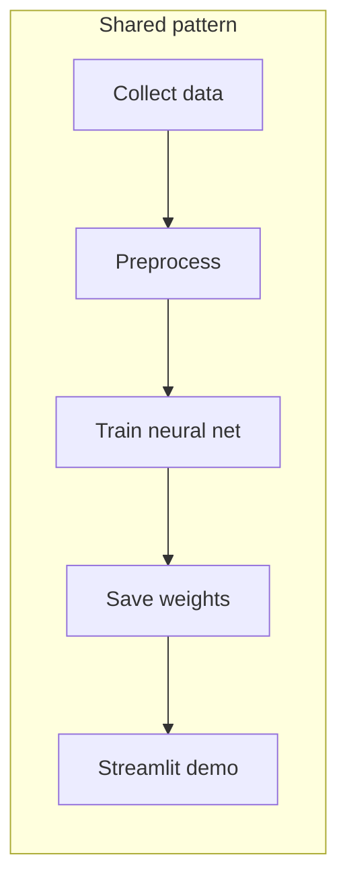
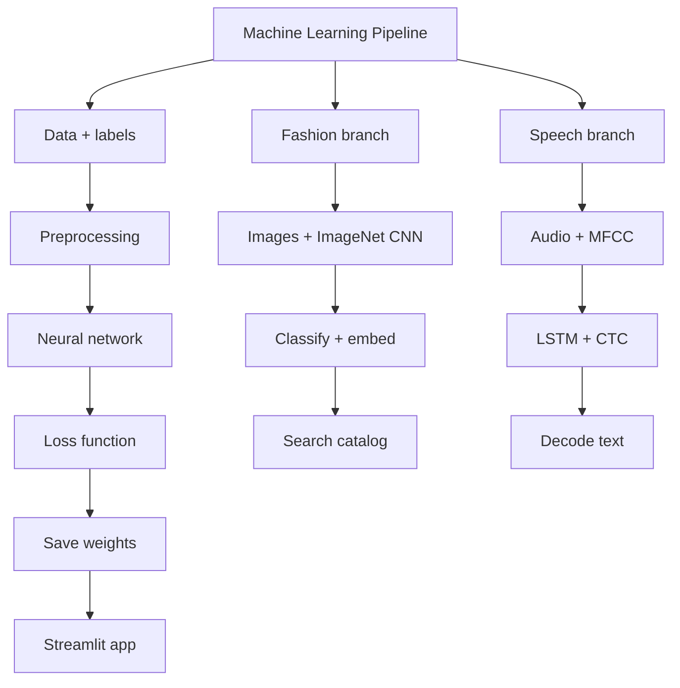

# Project Comparison Guide — Fashion Recommendation vs Speech Recognition

A side-by-side guide explaining **what is the same**, **what is different**, and **why** — so you can learn both projects as one ML story with two different problem types.

---

## Table of contents

1. [One-sentence summary of each project](#1-one-sentence-summary-of-each-project)
2. [Same goal shape, different problem type](#2-same-goal-shape-different-problem-type)
3. [Master comparison table](#3-master-comparison-table)
4. [Input data: images vs audio](#4-input-data-images-vs-audio)
5. [Preprocessing: why they look nothing alike](#5-preprocessing-why-they-look-nothing-alike)
6. [Models: ResNet18 vs LSTM](#6-models-resnet18-vs-lstm)
7. [Pretrained vs train from scratch](#7-pretrained-vs-train-from-scratch)
8. [Loss functions and what they optimize](#8-loss-functions-and-what-they-optimize)
9. [Training loop differences](#9-training-loop-differences)
10. [What gets saved and why Fashion has .npy files](#10-what-gets-saved-and-why-fashion-has-npy-files)
11. [Inference: recommendation vs transcription](#11-inference-recommendation-vs-transcription)
12. [Metrics: accuracy vs WER/CER](#12-metrics-accuracy-vs-wercer)
13. [Checkpoint strategy: last epoch vs best epoch](#13-checkpoint-strategy-last-epoch-vs-best-epoch)
14. [Streamlit apps compared](#14-streamlit-apps-compared)
15. [Project structure compared](#15-project-structure-compared)
16. [When to use which technique (learning map)](#16-when-to-use-which-technique-learning-map)
17. [Could we use pretrained models for speech?](#17-could-we-use-pretrained-models-for-speech)
18. [FAQ — questions you already asked](#18-faq--questions-you-already-asked)

---

## 1. One-sentence summary of each project

| Project | One sentence |
|---------|--------------|
| **Fashion Image Recommendation** | Train ResNet18 on clothing photos, build a catalog of image embeddings, recommend visually similar items. |
| **Speech Recognition** | Train an LSTM on audiobook speech, map MFCC audio features to text, transcribe new audio directly. |

---

## 2. Same goal shape, different problem type

Both projects follow the same **ML product pattern**:



But the **AI task** is different:

| | Fashion | Speech |
|---|---------|--------|
| **Input modality** | Image (pixels) | Audio (waveform) |
| **Output** | Similar images (search) | Text string (generation) |
| **ML task type** | Classification + retrieval | Sequence recognition |
| **User question** | "What looks like this?" | "What was said?" |

---

## 3. Master comparison table

| Topic | Fashion Recommendation | Speech Recognition |
|-------|------------------------|-------------------|
| **Dataset** | Fashion-MNIST | LibriSpeech train-clean-100 |
| **Train samples** | 60,000 images | ~25,685 audio clips (90% of 28,539) |
| **Test / val** | 10,000 fixed test set | ~2,854 validation (10% random split) |
| **Input size** | 224×224×3 tensor | Variable-length MFCC (time × 40) |
| **Model** | ResNet18 (CNN) | 2-layer bidirectional LSTM |
| **Pretrained?** | **Yes** — ImageNet | **No** — random init |
| **Loss** | CrossEntropyLoss | CTCLoss |
| **Output head** | 10 classes | 30 char classes + CTC blank |
| **Epochs** | ~12 (8 head + 4 finetune) | 30 |
| **Main metric** | Test accuracy ~93% | Val WER / CER |
| **Saved model** | `fashion_model.pth` (~43 MB) | `lstm_ctc_model.pth` (~8 MB) |
| **Extra artifacts** | `features.npy`, `labels.npy`, 60k PNGs | None |
| **Inference trick** | Cosine similarity on embeddings | Direct decode — no catalog |
| **Training script** | `scripts/train_model.py` | `train.py` |
| **Colab notebook** | (not in repo) | `notebooks/colab_train.ipynb` |
| **Utils package** | `utils/` (4 modules) | `model_utils.py` (single file) |

---

## 4. Input data: images vs audio

### Fashion-MNIST

```
One image = fixed grid of pixels
28×28 gray → resized to 224×224×3
Label = one integer 0–9 (T-shirt, Sneaker, ...)
```

**Properties:**
- Fixed dimensions (after resize)
- One label per image
- Small images, easy to batch
- Built into PyTorch (`torchvision.datasets`)

### LibriSpeech

```
One clip = variable-length waveform
Duration: 1 second to ~30+ seconds
Label = full sentence string ("chapter one missus rachel...")
```

**Properties:**
- **Variable length** — must pad batches and track true lengths (CTC)
- **Sequence label** — many characters per clip
- Large files (~6 GB download)
- Must download manually or via wget in Colab

### Why this matters

| Fixed-size images | Variable-length audio |
|-------------------|----------------------|
| Simple batching | Pad + length metadata |
| CrossEntropy works directly | Need CTC or attention |
| CNN natural fit | RNN/Transformer natural fit |

---

## 5. Preprocessing: why they look nothing alike

### Fashion pipeline

```
Grayscale 28×28
    → Resize 224×224
    → 3 channels (duplicate gray)
    → ToTensor (0–1)
    → ImageNet normalize (mean/std from ImageNet)
    → [Optional augment: flip, rotate]  (training only)
```

**Why ImageNet normalization?**  
Because we load **ImageNet-pretrained** ResNet weights. Those weights expect pixels scaled the same way they were during ImageNet training.

### Speech pipeline

```
Raw waveform
    → Load mono 16 kHz
    → MFCC (40 coeffs, 25 ms window, 10 ms hop)
    → Per-utterance normalize (mean/std)
    → Tensor (time, 40)
```

**Why MFCC?**  
Classic speech features — compress raw audio into numbers that highlight speech patterns. LSTM was trained on MFCC, not raw waveforms.

**Why no ImageNet-style norm?**  
No pretrained speech backbone in this project. We normalize MFCC per clip instead.

### Side-by-side

| Step | Fashion | Speech |
|------|---------|--------|
| Domain knowledge | ImageNet stats | Speech frame physics (MFCC) |
| Must match at inference? | **Yes** — or recommendations break | **Yes** — or transcription breaks |
| Defined in | `utils/preprocessing.py` | `model_utils.py` |
| Augmentation | Yes (train) | No (currently) |

---

## 6. Models: ResNet18 vs LSTM

### ResNet18 (Fashion) — Convolutional

```
Image (H×W×3)
    → Conv layers (local patterns: edges, textures)
    → Residual blocks (deep but trainable)
    → Global pool
    → FC → 10 class scores
```

**Strengths for images:**
- Spatial patterns (sleeve shape, shoe sole)
- Proven architecture
- Pretrained on millions of images

**Output:** One vector of 10 logits **per image**.

### LSTM (Speech) — Recurrent

```
MFCC sequence (T×40)
    → LSTM step by step over time
    → Linear → 30 scores **per time frame**
    → CTC decode → one string
```

**Strengths for sequences:**
- Handles variable time length
- Models order ("hello" vs "olleh")
- Classic ASR baseline

**Output:** A **sequence** of predictions aligned to audio time.

### Architecture diagram comparison

```
FASHION (spatial):          SPEECH (temporal):

[pixel grid]                [frame 1][frame 2]...[frame T]
     ↓                              ↓
  CNN layers                      LSTM layers
     ↓                              ↓
 1 decision                    T small decisions
 (which class?)                (which char per frame?)
                                     ↓
                               CTC → one sentence
```

---

## 7. Pretrained vs train from scratch

This is the **biggest conceptual difference** between your two projects.

### Fashion: Transfer learning ✅


**Why it works:**
- Low-level vision (edges, textures) transfers from ImageNet to fashion
- 60k fashion images enough to **adapt**, not to learn vision from zero
- Faster training, higher accuracy

**Code idea:**
```python
model = resnet18(weights=ResNet18_Weights.IMAGENET1K_V1)
for param in model.parameters():
    param.requires_grad = False  # freeze
model.fc = nn.Linear(512, 10)    # new head — train this
```

### Speech: From scratch ❌ (no pretrained backbone)


**Why we don't use ImageNet here:**
- ImageNet weights are for **pixels**, not MFCC sequences
- Wrong input shape, wrong modality, zero transferable knowledge

**Why we don't use Whisper/Wav2Vec2 in this project:**
- Different project goal (teach MFCC + LSTM + CTC)
- Those models are larger, pretrained on 1000s of hours of speech
- Would be "call API / load hub model" — less custom training visibility

### Comparison table

| Question | Fashion | Speech |
|----------|---------|--------|
| Start random? | No | Yes |
| Pretrained on what? | ImageNet (general objects) | N/A in this repo |
| Freeze layers? | Yes (phase 1) | No |
| Fine-tune? | layer4 only | Whole LSTM |
| Data needed | 60k OK with pretrain | 28k clips — modest for ASR from scratch |
| Typical quality | High (~93% acc) | Prototype (imperfect WER) |

---

## 8. Loss functions and what they optimize

### CrossEntropyLoss (Fashion)

```
Model output: 10 scores (one per class)
Target: single integer 0–9
Loss: how wrong is the predicted class?
```

**One prediction per image.** Simple.

### CTCLoss (Speech)

```
Model output: T × 30 scores (per time frame)
Target: sequence of character indices (variable length)
Loss: how wrong is the alignment + characters?
```

**Many frames, fewer characters.** CTC finds alignment during training.

### Intuition

| | Fashion | Speech |
|---|---------|--------|
| Analogy | Pick one answer on a quiz | Type a sentence while someone talks — timing unclear |
| Alignment | Not needed | **Core problem** — CTC solves it |
| Wrong loss if misused | N/A | Using CrossEntropy on frames without alignment fails |

---

## 9. Training loop differences

### Fashion (two-phase)

| Phase | What's trainable | Epochs | LR |
|-------|------------------|--------|-----|
| 1 — Head | `fc` only | 8 | 1e-3 |
| 2 — Fine-tune | `layer4` + `fc` | 4 | 1e-4 (lower) |

Plus: **data augmentation** on training images only.

### Speech (single-phase)

| Phase | What's trainable | Epochs | LR |
|-------|------------------|--------|-----|
| Full model | Entire LSTM + linear | 30 | 1e-3 (with scheduler) |

Plus:
- **Gradient clipping** (speech)
- **Validation WER/CER** each epoch
- **Best checkpoint** saving
- **Batched** training with correct CTC lengths

### Batching contrast

| Fashion | Speech |
|---------|--------|
| 64 images — all same 224×224 | 16 clips — **different lengths**, padded |
| Simple stack into tensor | Must pass `input_lengths` to CTC |

---

## 10. What gets saved and why Fashion has .npy files

### Fashion saves 3 things (+ images)

| Artifact | Why it exists |
|----------|---------------|
| `fashion_model.pth` | Classify uploads + extract embeddings |
| `features.npy` (60000×512) | **Precomputed catalog** for fast similarity search |
| `labels.npy` (60000,) | Show class names, optional category boost |
| `sample_images/*.png` | Display catalog items in UI |

**Recommendation = search a database of fingerprints.**  
You compute embeddings **once** offline, then at runtime only compare query vs catalog.

### Speech saves 1 thing (really)

| Artifact | Why it exists |
|----------|---------------|
| `lstm_ctc_model.pth` | Maps audio → text directly |
| `lstm_ctc_model_best.pth` | Backup of best validation epoch |

**No catalog.** Each new audio clip is processed fresh through the LSTM.

### Why the difference?

| Task | Needs precomputed database? |
|------|----------------------------|
| Find similar images in 60k catalog | **Yes** — brute force each upload would re-run CNN 60k times |
| Transcribe one sentence | **No** — one forward pass per upload |

*(Production ASR might cache nothing; production recommenders almost always precompute item embeddings.)*

---

## 11. Inference: recommendation vs transcription

### Fashion app flow

```
Upload image
    → preprocess (eval transform)
    → ResNet backbone → 512-dim embedding
    → L2 normalize
    → cosine similarity vs all 60000 catalog embeddings
    → top 5 indices
    → show PNGs from sample_images/
```

**Uses:** model + features.npy + labels.npy + image folder

### Speech app flow

```
Upload / record audio
    → MFCC (same as training)
    → LSTM forward
    → greedy CTC decode
    → display text string
```

**Uses:** model only (+ shared preprocessing in model_utils.py)

### Diagram

```
FASHION:  query → embedding → SEARCH catalog → top-K images

SPEECH:   audio → MFCC → LSTM → DECODE → text
          (no search step)
```

---

## 12. Metrics: accuracy vs WER/CER

### Fashion: classification accuracy

```
Test accuracy = correct predictions / 10,000 × 100%
Target: ~92.81%
```

One wrong class = one error. Clear and bounded 0–100%.

### Speech: WER and CER

```
WER = (substitutions + insertions + deletions) / words in reference
CER = same but at character level
```

Example:
- Reference: `"hello world"`
- Prediction: `"hello word"`
- WER = 1/2 = 50% (one word wrong)
- CER = lower (most chars correct)

**Lower is better.** WER = 1.0 means completely wrong at word level.

### Why speech metrics are harsher

| | Fashion | Speech |
|---|---------|--------|
| Partial credit | Wrong class = 0 | CER captures near-misses |
| Output size | 1 label | Dozens of characters |
| Good score | >90% accuracy | WER <10% is strong (production systems) |

Our LSTM prototype may still have high WER — that's expected without pretrained speech models.

---

## 13. Checkpoint strategy: last epoch vs best epoch

### Your Fashion project (typical)

```python
# After all epochs:
torch.save(model.state_dict(), "fashion_model.pth")
```

→ **Last epoch weights** (epoch 12 or 15).

Works well when:
- Validation tracks training closely
- Fine-tuning is short
- No strong overfitting

### Speech project (explicit best)

```python
if val_cer < best_cer:
    save("lstm_ctc_model_best.pth")
# at end:
copy best → lstm_ctc_model.pth
```

→ **Best validation epoch**, not necessarily epoch 30.

Works better when:
- Long training (30 epochs)
- Overfitting risk on audio
- Validation CER rises while train loss falls

### "Why not combine 30 epochs?"

**Neither project combines epochs.** Both save **one snapshot** of weights.

| Misconception | Reality |
|---------------|---------|
| "30 epochs = 30 models merged" | Each epoch **overwrites** the same weights |
| "Final file = average of epochs" | Final file = **one point in time** |
| Fashion vs Speech | Same snapshot idea, **different rule for which epoch** |

---

## 14. Streamlit apps compared

| Feature | Fashion `app.py` | Speech `app.py` |
|---------|------------------|-----------------|
| User input | Upload image | Upload or record audio |
| Core operation | Similarity search | Transcription |
| Sidebar | Class boost, settings | Model info |
| Depends on | model + npy + PNG catalog | model only |
| Visualization | Shows 5 similar images | Waveform plot |
| Cached load | Model + features | Model only |

Both use `@st.cache_resource` to load heavy objects once.

---

## 15. Project structure compared

```
FASHION                          SPEECH
───────                          ──────
FinalProject_1.ipynb             notebooks/speech_recognition.ipynb
scripts/train_model.py           train.py
scripts/verify_training.py       (none yet)
scripts/export_sample_images.py  (none — no catalog)
utils/                           model_utils.py
  model.py                         (all-in-one)
  preprocessing.py
  recommender.py
app.py                           app.py
models/fashion_model.pth         model/lstm_ctc_model.pth
features/features.npy            (none)
features/labels.npy              (none)
data/sample_images/              (none)
data/FashionMNIST/               data/raw/LibriSpeech/
```

**Fashion is more files** because recommendation needs catalog export + search utilities.  
**Speech is simpler at inference** — one model file, one predict function.

---

## 16. When to use which technique (learning map)

Use this table when you face a **new** project:

| Your problem | Likely approach |
|--------------|-----------------|
| Image classification, small data | Pretrained CNN + transfer learning (like Fashion) |
| Image similarity / search | Embeddings + cosine similarity (like Fashion) |
| Speech-to-text, production quality | Pretrained Whisper / Wav2Vec2 / Conformer |
| Speech-to-text, learning basics | MFCC + RNN + CTC (like this project) |
| Fixed-size inputs | CNN, simple batching |
| Variable-length sequences | RNN, Transformer, CTC or attention |
| One label per input | CrossEntropy |
| Sequence output, alignment unclear | CTC or attention |

---

## 17. Could we use pretrained models for speech?

**Yes — in real products, almost always.**

| Model | Type | Pretrained on |
|-------|------|---------------|
| **Whisper** (OpenAI) | Transformer encoder-decoder | 680k hours speech |
| **Wav2Vec2** (Meta) | Self-supervised audio | LibriSpeech + more |
| **DeepSpeech** (legacy) | RNN + CTC | Large speech corpora |

### Why this project doesn't use them

| Reason | Detail |
|--------|--------|
| **Learning** | You see MFCC, LSTM, CTC end-to-end |
| **Simplicity** | ~8 MB model, no Hugging Face pipeline required |
| **Course scope** | Classic ASR pipeline matches GUVI / project brief |
| **Compute** | Whisper is heavier; fine-tuning still needs GPU |

### If you upgraded speech project to pretrained

You would change **modality handling** similar to how Fashion uses ImageNet:

```
Fashion:  ImageNet ResNet → fashion classes
Speech:   Wav2Vec2 → fine-tune on LibriSpeech (or zero-shot Whisper)
```

Same **transfer learning idea**, different **pretrained source**.

---

## 18. FAQ — questions you already asked

### "Fashion used final model.pth — why speech has best?"

Fashion likely saved **last epoch**. Speech saves **best val CER**. Both are one file; different selection rule. Speech uses best because overfitting is common over 30 epochs.

### "Why can't speech use ImageNet pretrained?"

Wrong data type. ImageNet = pictures of cats and cars. Speech needs weights trained on **audio**, or train from scratch on speech features (MFCC).

### "Why no features.npy in speech?"

No catalog to search. Transcription is direct generation, not retrieval.

### "Which project is harder to train?"

| | Fashion | Speech |
|---|---------|--------|
| Training difficulty | Easier (pretrained + small images) | Harder (from scratch + sequences + CTC) |
| Data prep | Auto-download | 6 GB manual/Colab download |
| Time to good results | Hours on CPU | Days on CPU, hours on GPU |
| App complexity | Higher (catalog + search) | Lower (one predict call) |

### "What concepts transfer between projects?"

| Concept | Applies to both? |
|---------|------------------|
| Train / val split | ✅ |
| Epochs, batches, Adam | ✅ |
| Save `.pth`, load in Streamlit | ✅ |
| Preprocessing must match inference | ✅ |
| Transfer learning | Fashion yes, Speech no (in this repo) |
| Embeddings + cosine search | Fashion yes, Speech no |
| CTC | Speech only |
| Augmentation | Fashion yes, Speech not yet |

---

## Final picture: two branches of one learning tree



**Fashion:** pretrained vision → **similarity**  
**Speech:** trained-from-scratch sequence model → **transcription**

Same engineering habits. Different AI problem shapes. Different reasons for pretrained weights.

---

## Where to read more

| Document | Content |
|----------|---------|
| `Image Recommendation Guide.md` | Full Fashion project deep dive |
| `Speech Recognition Guide.md` | Full Speech project deep dive |
| `README.md` | Quick setup for speech project |
