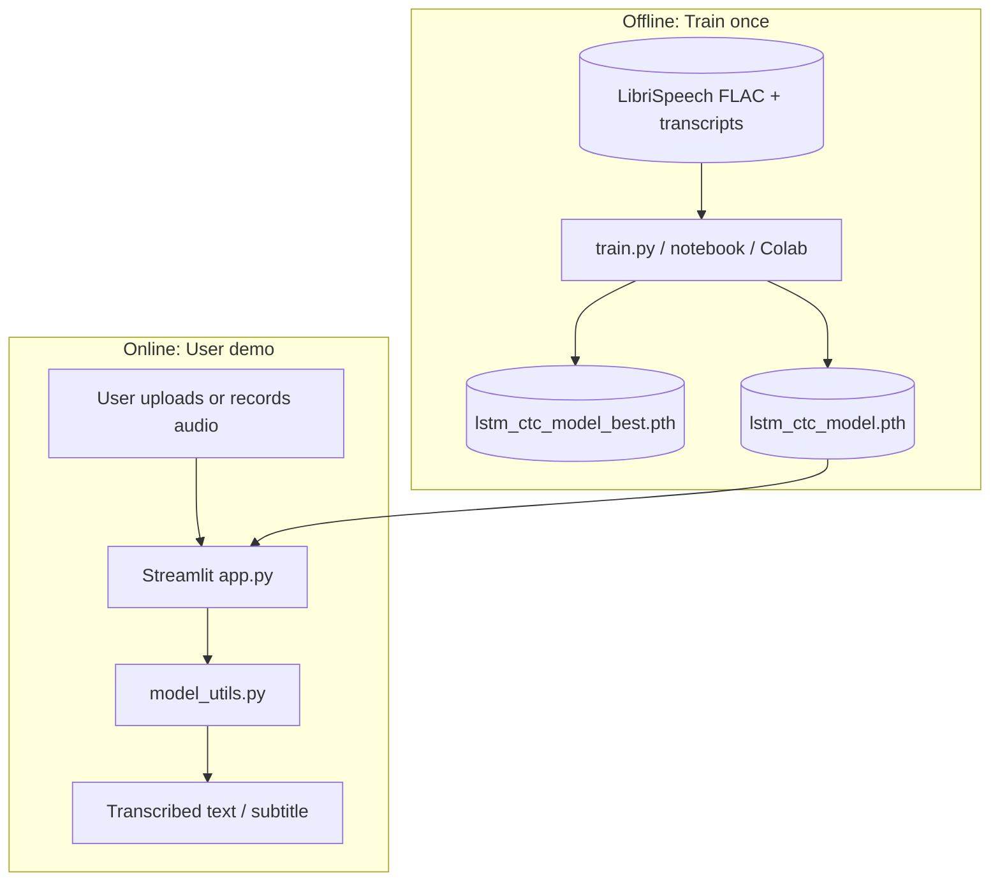
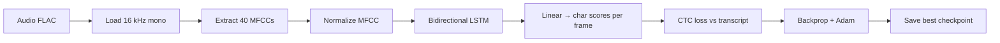
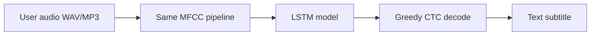
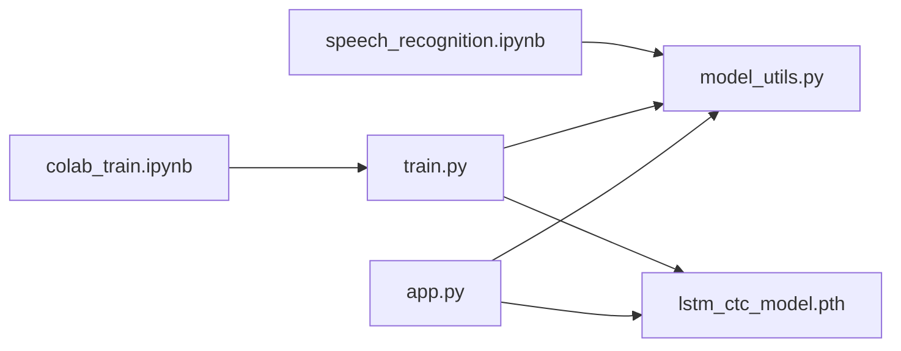

# Speech Recognition System — Learning Guide

A complete guide to understanding this project from scratch: what it does, how audio becomes text, how training is set up, and how all the pieces connect.

---

## Table of contents

1. [What is this project?](#1-what-is-this-project)
2. [Key concepts in plain English](#2-key-concepts-in-plain-english)
3. [The dataset: LibriSpeech](#3-the-dataset-librispeech)
4. [Project architecture (big picture)](#4-project-architecture-big-picture)
5. [LSTM + CTC explained](#5-lstm--ctc-explained)
6. [Why we train from scratch (no pretrained model)](#6-why-we-train-from-scratch-no-pretrained-model)
7. [Audio preprocessing (MFCC)](#7-audio-preprocessing-mfcc)
8. [Training framework (step by step)](#8-training-framework-step-by-step)
9. [What gets saved after training](#9-what-gets-saved-after-training)
10. [Best model vs final model](#10-best-model-vs-final-model)
11. [How transcription works at inference](#11-how-transcription-works-at-inference)
12. [Train vs validation split](#12-train-vs-validation-split)
13. [The Streamlit app](#13-the-streamlit-app)
14. [File and folder map](#14-file-and-folder-map)
15. [Notebook vs training script vs Colab](#15-notebook-vs-training-script-vs-colab)
16. [Important settings explained](#16-important-settings-explained)
17. [How to run everything](#17-how-to-run-everything)
18. [Glossary](#18-glossary)

---

## 1. What is this project?

This project is a **sentence-level speech recognition (ASR)** system: it converts spoken English audio into text.

**Simple flow:**

```
You give it audio  →  It outputs a text transcript / subtitle
```

**Example:** Upload a clip of someone saying *"hello world"* → get back `"hello world"` (or close to it).

**Two main parts:**

| Part | File(s) | Purpose |
|------|---------|---------|
| **Training pipeline** | `notebooks/speech_recognition.ipynb`, `train.py`, `notebooks/colab_train.ipynb` | Train the LSTM model on LibriSpeech |
| **Demo app** | `app.py` + `model_utils.py` | Let users upload/record audio and see transcription |

**Business framing in the README:** intelligent live captioning for online video — the Streamlit app is a prototype of that idea.

---

## 2. Key concepts in plain English

### Automatic Speech Recognition (ASR)
The task of turning speech audio into written text. Also called speech-to-text.

### Classification vs sequence labeling
- **Image classification (Fashion project):** one label per image → `"Sneaker"`
- **Speech recognition (this project):** many outputs over time → `"hello world"` (a **sequence** of characters)

Speech is **longer and ordered**. The model must align sounds in time with letters.

### MFCC (features)
Numbers that describe **how speech sounds** in short time windows. The neural network does not eat raw waveform directly — it eats MFCC frames.

### LSTM (Long Short-Term Memory)
A type of recurrent neural network good at **sequences** (audio frames over time, then characters over time).

### CTC (Connectionist Temporal Classification)
A loss function that lets the model learn **without** hand-aligning each audio frame to each letter. It handles "when did the speaker say which letter?"

### Greedy CTC decoding
After the model outputs scores per frame, we pick the most likely character at each step and collapse repeats → final text string.

### Epoch
One full pass through all training audio clips. With ~25,685 train clips, 1 epoch = the model has seen all of them once.

### WER and CER
- **WER (Word Error Rate):** how many words wrong vs ground truth
- **CER (Character Error Rate):** how many characters wrong

Lower is better. Used on the **validation** set to measure quality.

---

## 3. The dataset: LibriSpeech

**LibriSpeech** is a standard ASR benchmark: read English audiobooks.

| Property | Value |
|----------|-------|
| Subset we use | `train-clean-100` |
| Clips | ~28,539 |
| Audio format | FLAC, mono, 16 kHz |
| Labels | Sentence transcripts (text files) |
| Source | [OpenSLR SLR12](http://www.openslr.org/12/) |

### How one sample is stored

```
data/raw/LibriSpeech/train-clean-100/
  └── 103/
      └── 1241/
          ├── 103-1241-0000.flac          ← audio
          ├── 103-1241-0001.flac
          └── 103-1241.trans.txt          ← transcripts
```

Example line in `.trans.txt`:

```
103-1241-0000 CHAPTER ONE MISSUS RACHEL LYNDE IS SURPRISED
```

We lowercase the text and map characters to indices for training.

### Character vocabulary (28 chars)

```
a-z, space, apostrophe
```

Plus CTC **blank** token (index 0) — used internally, not printed in output.

---

## 4. Project architecture (big picture)

### System overview



### Data flow during training



### Data flow during transcription (app)



**Critical rule:** MFCC settings and normalization must match between training and `app.py` (both use `model_utils.py`).

---

## 5. LSTM + CTC explained

### Model architecture

```
Input: (batch, time_frames, 40 MFCC features)
        ↓
Bidirectional LSTM — 2 layers, 256 hidden units, dropout 0.2
        ↓
Linear layer → 30 outputs per time step (28 chars + blank + spare)
        ↓
CTC loss (training) or argmax + decode (inference)
```

### Why bidirectional?

The LSTM reads the sequence **forward and backward**, so each frame can use context from both past and future audio. Helpful for recognizing whole words.

### What CTC solves

Audio has **many** frames per word. Text has **fewer** characters. CTC allows:
- multiple frames → one character
- blank frames → "no character here"
- learning alignment automatically

### Decoding (inference)

```python
# Simplified idea:
for each time step:
    pick highest-scoring character index
collapse repeated characters
remove blank
→ string
```

Defined in `model_utils.py` → `decode_prediction()`.

---

## 6. Why we train from scratch (no pretrained model)

Unlike the Fashion project (ResNet18 + ImageNet), this project uses a **custom small LSTM** trained **from random initialization**.

| Reason | Explanation |
|--------|---------------|
| **Modality** | ImageNet weights help **images**, not **speech** |
| **Input shape** | We use MFCC sequences, not pixels |
| **Task** | Sequence-to-text with CTC, not image classification |
| **Project scope** | Educational ASR pipeline from audio features to text |

**Could we use pretrained speech models?** Yes — Whisper, Wav2Vec2, etc. are much stronger but are a different architecture and heavier setup. This project teaches classic **MFCC + RNN + CTC**.

See `Project Comparison Guide.md` for a side-by-side with the Fashion recommendation project.

---

## 7. Audio preprocessing (MFCC)

All preprocessing lives in `model_utils.py` → `extract_mfcc()`.

### Steps (in order)

| Step | Setting | Why |
|------|---------|-----|
| Load audio | 16 kHz mono | LibriSpeech standard |
| Frame analysis | 25 ms window (`n_fft=400`) | Short slice of waveform |
| Frame hop | 10 ms (`hop_length=160`) | How often we compute a new frame |
| MFCC count | 40 coefficients | Compact speech representation |
| Normalize | Per-utterance mean/std | Stabilizes training |

### Shape intuition

```
10 seconds of audio
    → ~1000 time frames (10 ms hop)
    → MFCC shape: (40, ~1000) in librosa
    → transposed to (1000, 40) for LSTM input
```

### Train vs app

| | Training | App |
|---|----------|-----|
| MFCC params | Same constants | Same (`model_utils.py`) |
| Normalization | Yes | Yes |
| Augmentation | No (currently) | N/A |

---

## 8. Training framework (step by step)

Training can be run from:
- `train.py` (terminal — full dataset)
- `notebooks/speech_recognition.ipynb` (learning — originally 8k samples)
- `notebooks/colab_train.ipynb` (GPU on Google Colab)

### High-level loop

```
1. Load all LibriSpeech paths + transcripts
2. Split 90% train / 10% validation
3. For each epoch:
   a. Shuffle training batches
   b. For each batch:
      - Extract MFCC on the fly
      - Pad batch to same length (track true lengths for CTC!)
      - Forward → CTC loss → backward → Adam
      - Gradient clipping (max norm 5)
   c. Evaluate on validation → WER, CER
   d. If val CER improved → save lstm_ctc_model_best.pth
   e. LR scheduler step (ReduceLROnPlateau)
4. Copy best weights → lstm_ctc_model.pth for the app
```

### What happens inside one batch

```
For each batch of 16 audio clips:
    1. MFCC extract + pad sequences
    2. Forward pass → frame-wise character logits
    3. log_softmax + CTC loss vs true transcript
    4. Backward pass
    5. Clip gradients
    6. Optimizer step
```

### Loss, optimizer, scheduler

| Component | Choice | Purpose |
|-----------|--------|---------|
| Loss | `CTCLoss(blank=0)` | Sequence alignment without manual labels per frame |
| Optimizer | Adam, lr=1e-3, weight_decay=1e-5 | Update weights |
| Scheduler | ReduceLROnPlateau | Lower LR when val loss plateaus |
| Batch size | 16 (CPU) / 32 (Colab GPU) | Speed vs memory |
| Epochs | 30 default | Multiple passes over data |

### Key fix vs original notebook

The old notebook passed **padded length** to CTC (wrong). `train.py` passes **actual audio frame count** per sample — critical for CTC to learn correctly.

---

## 9. What gets saved after training

| File | Size (approx) | Purpose |
|------|----------------|---------|
| `model/lstm_ctc_model_best.pth` | ~8–9 MB | Weights from epoch with **lowest validation CER** |
| `model/lstm_ctc_model.pth` | ~8–9 MB | **Copy of best** — file the Streamlit app loads |

**Not saved (unlike Fashion project):**
- No `features.npy` catalog
- No `labels.npy`
- No precomputed embedding database

Speech recognition runs **direct inference** on each new audio clip — no similarity search.

Both files are in `.gitignore` (too large / trained locally). You copy them from Colab or local training into `model/`.

---

## 10. Best model vs final model

### One set of weights — many snapshots

Each epoch **updates the same weights**. We do not "combine 30 epochs into one file."

| File | When saved | Which weights |
|------|------------|---------------|
| `lstm_ctc_model_best.pth` | After any epoch where **val CER improves** | Best on validation so far |
| `lstm_ctc_model.pth` | End of training | **Copy of best** (for `app.py`) |

### Why not always use the last epoch?

Training loss can keep dropping while **validation** WER/CER gets worse (**overfitting**). The best checkpoint is the snapshot that generalized best to unseen audio.

### Same idea as your CNN project?

Your Fashion project likely saved **last epoch** as `model.pth`. This project saves **best validation epoch** — safer for speech, still one `.pth` file at the end.

---

## 11. How transcription works at inference

Defined in `model_utils.py` → `predict_from_audio()`.

```
1. load_model("model/lstm_ctc_model.pth")
2. extract_mfcc(audio) — same as training
3. tensor shape (1, time, 40)
4. model forward → (1, time, 30) logits
5. decode_prediction() → text string
6. Display in Streamlit
```

No catalog lookup. No cosine similarity. Pure **audio → text** mapping learned during training.

---

## 12. Train vs validation split

| Split | ~Count | Used for |
|-------|--------|----------|
| Train (90%) | 25,685 | Weight updates |
| Validation (10%) | 2,854 | WER/CER only — **never trained on** |

Random split with `random_state=42` for reproducibility.

**LibriSpeech also has official test sets** (`test-clean`, etc.) — we could add those later for final benchmarking; current `train.py` uses a random 10% holdout from train-clean-100.

---

## 13. The Streamlit app

**File:** `app.py`

### Features

| Feature | Description |
|---------|-------------|
| Upload audio | WAV, MP3, FLAC, M4A, OGG |
| Record audio | Browser microphone |
| Waveform plot | Matplotlib visualization |
| Transcribe button | Calls `predict_from_audio()` |
| About tab | Architecture and dataset info |

### Model loading

```python
@st.cache_resource
def load_speech_model():
    model = load_model("model/lstm_ctc_model.pth")
```

Model loads once and stays in memory for the session.

### What the app does NOT do (yet)

- Real-time streaming from video
- WER/CER evaluation UI (mentioned in README but not in app)
- GPU requirement — runs on CPU fine for demo

---

## 14. File and folder map

```
Speech_Recognition/
├── app.py                          # Streamlit transcription demo
├── train.py                        # Full-dataset terminal training
├── model_utils.py                  # Model, MFCC, encode/decode, predict
├── requirements.txt
├── README.md
├── Speech Recognition Guide.md     # This file
├── Project Comparison Guide.md     # vs Fashion recommendation project
│
├── notebooks/
│   ├── speech_recognition.ipynb    # Original learning notebook (8k samples)
│   └── colab_train.ipynb           # Colab GPU workflow + dataset download
│
├── model/                          # Created after training (gitignored)
│   ├── lstm_ctc_model.pth          # App loads this
│   └── lstm_ctc_model_best.pth     # Best val checkpoint
│
└── data/                           # Gitignored
    └── raw/LibriSpeech/train-clean-100/
        └── [speaker/chapter folders with .flac + .trans.txt]
```

### Which file talks to which



---

## 15. Notebook vs training script vs Colab

| | `speech_recognition.ipynb` | `train.py` | `colab_train.ipynb` |
|---|---------------------------|------------|---------------------|
| **Best for** | Learning step-by-step | Local full training | GPU training (free Colab) |
| **Dataset** | Originally 8,000 samples | Full ~28,539 | Full ~28,539 |
| **Run how** | Run cells | `python train.py` | Run cells → calls `train.py` |
| **Batching** | Batch size 1 (slow) | Batched + validation | Same as train.py |
| **CTC lengths** | Old bug (padded len) | Fixed | Fixed (via train.py) |
| **Output** | `model/lstm_ctc_model.pth` | best + final model | Same |

**You only need one training path** to produce the model. Use Colab for speed, `train.py` locally if you have time/GPU.

---

## 16. Important settings explained

### `--epochs`

```bash
python train.py --epochs 30
```

More epochs → more learning, but risk overfitting. Validation CER tells you when to stop trusting later epochs.

### `--batch-size`

```bash
python train.py --batch-size 16   # CPU
python train.py --batch-size 32   # Colab GPU
```

Larger batch = fewer steps per epoch, needs more RAM/VRAM.

### `--val-split`

```bash
python train.py --val-split 0.1
```

Fraction held out for WER/CER. Not used for gradient updates.

### MFCC constants (do not change without retraining)

```python
SAMPLE_RATE = 16000
N_MFCC = 40
N_FFT = 400
HOP_LENGTH = 160
```

In `model_utils.py` — app and training must match.

---

## 17. How to run everything

### First-time setup (local)

```powershell
cd C:\Speech_Recognition
python -m venv .venv
.\.venv\Scripts\Activate.ps1
pip install -r requirements.txt
```

Download LibriSpeech `train-clean-100` from http://www.openslr.org/12/ into `data/raw/LibriSpeech/`.

### Train the model

**Option A — Colab (recommended for speed)**

1. Open `notebooks/colab_train.ipynb` on Google Colab
2. Runtime → T4 GPU
3. Run all cells (clone, download dataset, mount Drive, train)
4. Download `lstm_ctc_model.pth` to your PC → `model/`

**Option B — Local script**

```powershell
python train.py --epochs 30 --batch-size 16
```

**Option C — Learning notebook**

Open `notebooks/speech_recognition.ipynb` — good for understanding, not full dataset.

### Run the demo app

```powershell
streamlit run app.py
```

Open http://localhost:8501 — upload or record audio → Transcribe.

### Expected quality (realistic)

This is a **prototype** LSTM, not Whisper. Expect imperfect transcripts. Metrics depend on training; validation CER ~0.25–0.40 is a reasonable target after improvements.

---

## 18. Glossary

| Term | Definition |
|------|------------|
| **ASR** | Automatic Speech Recognition — speech to text |
| **LibriSpeech** | Open audiobook speech corpus for ASR research |
| **MFCC** | Mel-frequency cepstral coefficients — numeric speech features |
| **LSTM** | Recurrent network for sequences |
| **CTC** | Loss that aligns audio frames to text without manual timing labels |
| **Blank (CTC)** | Special token meaning "no character at this frame" |
| **Greedy decode** | Pick best character per frame, collapse repeats |
| **WER** | Word Error Rate — % words wrong |
| **CER** | Character Error Rate — % characters wrong |
| **Epoch** | One full pass through training data |
| **Batch** | Multiple clips processed together |
| **Validation** | Held-out data for measuring generalization |
| **Overfitting** | Model memorizes training data, worse on new audio |
| **Bidirectional LSTM** | Reads sequence forward and backward |
| **`.pth` file** | PyTorch saved model weights |
| **Streamlit** | Python library for simple web UIs |
| **Librosa** | Audio processing library (load audio, MFCC) |
| **Pretrained** | Weights learned on another task/dataset first — **not used here** |
| **Transfer learning** | Reusing pretrained weights — **Fashion project yes, this project no** |

---

## Quick mental model

```
Sound waves  →  MFCC numbers  →  LSTM  →  character scores  →  CTC decode  →  text
     ↑              ↑               ↑
  microphone    feature extract   learned from LibriSpeech
```

You train the LSTM weights once. The app reuses those weights for any new audio you upload.
